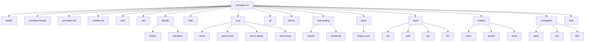

# CLI Command Tree

Current command hierarchy from `src/infra/cli/index.ts`.

```mermaid
flowchart TD
  ROOT[memphis-v4]

  ROOT --> HEALTH[health]
  ROOT --> PHEALTH[providers:health]
  ROOT --> PROVIDERS[providers list]
  ROOT --> MODELS[models list]

  ROOT --> CHAT[chat]
  ROOT --> ASK[ask]
  ROOT --> DECIDE[decide]
  DECIDE --> DH[history]
  DECIDE --> DT[transition]
  ROOT --> INFER[infer]

  ROOT --> MCP[mcp]
  MCP --> MS[serve]
  MCP --> MS1[serve-once]
  MCP --> MSS[serve-status]
  MCP --> MST[serve-stop]

  ROOT --> TUI[tui]
  ROOT --> DOCTOR[doctor]

  ROOT --> ONBOARD[onboarding]
  ONBOARD --> OW[wizard]
  ONBOARD --> OB[bootstrap]

  ROOT --> CHAIN[chain]
  CHAIN --> CI[import_json]

  ROOT --> VAULT[vault]
  VAULT --> VI[init]
  VAULT --> VA[add]
  VAULT --> VG[get]
  VAULT --> VL[list]

  ROOT --> EMBED[embed]
  EMBED --> ES[store]
  EMBED --> EQ[search]
  EMBED --> ER[reset]

  ROOT --> COMPLETION[completion]
  COMPLETION --> B[bash]
  COMPLETION --> Z[zsh]
  COMPLETION --> F[fish]

  ROOT --> HELP[help]
```
