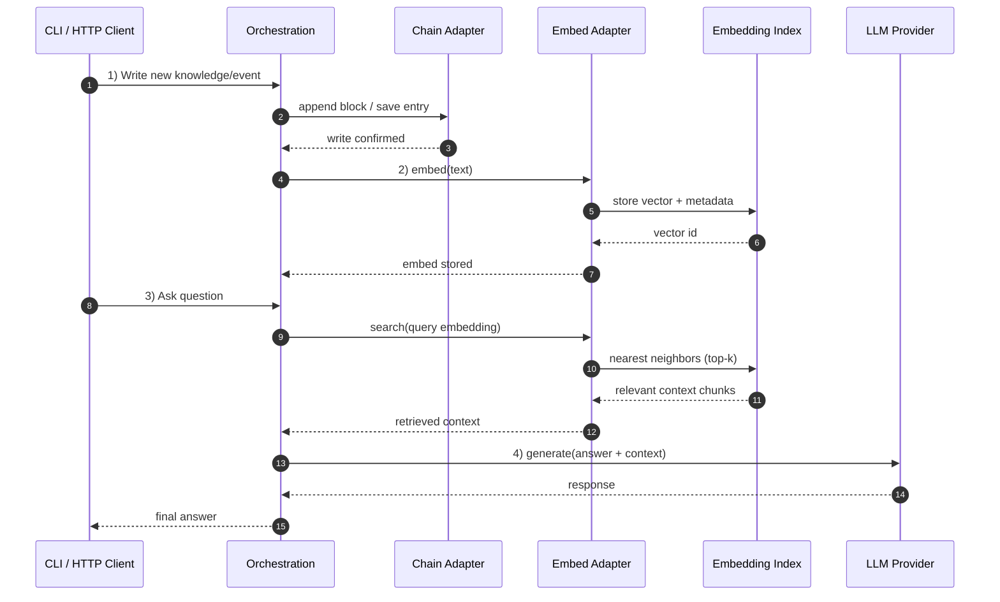

# Data Flow

Primary operational flow for memory + retrieval: **chain write → embed → search → ask**.

```mermaid
sequenceDiagram
  autonumber
  participant C as CLI / HTTP Client
  participant O as Orchestration
  participant CH as Chain Adapter
  participant EM as Embed Adapter
  participant IDX as Embedding Index
  participant LLM as LLM Provider

  C->>O: 1) Write new knowledge/event
  O->>CH: append block / save entry
  CH-->>O: write confirmed

  O->>EM: 2) embed(text)
  EM->>IDX: store vector + metadata
  IDX-->>EM: vector id
  EM-->>O: embed stored

  C->>O: 3) Ask question
  O->>EM: search(query embedding)
  EM->>IDX: nearest neighbors (top-k)
  IDX-->>EM: relevant context chunks
  EM-->>O: retrieved context

  O->>LLM: 4) generate(answer + context)
  LLM-->>O: response
  O-->>C: final answer
```
