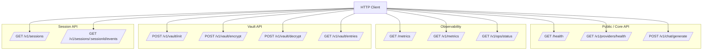

# HTTP API Endpoints

API surface based on `src/infra/http/server.ts` and `src/infra/http/routes/chat.ts`.

```mermaid
flowchart TD
  CLIENT[HTTP Client]

  subgraph Public / Core API
    H[/GET /health/]
    PH[/GET /v1/providers/health/]
    CHAT[/POST /v1/chat/generate/]
  end

  subgraph Observability
    M[/GET /metrics/]
    VM[/GET /v1/metrics/]
    OPS[/GET /v1/ops/status/]
  end

  subgraph Vault API
    VI[/POST /v1/vault/init/]
    VE[/POST /v1/vault/encrypt/]
    VD[/POST /v1/vault/decrypt/]
    VL[/GET /v1/vault/entries/]
  end

  subgraph Session API
    S[/GET /v1/sessions/]
    SE[/GET /v1/sessions/:sessionId/events/]
  end

  CLIENT --> H
  CLIENT --> PH
  CLIENT --> CHAT
  CLIENT --> M
  CLIENT --> VM
  CLIENT --> OPS
  CLIENT --> VI
  CLIENT --> VE
  CLIENT --> VD
  CLIENT --> VL
  CLIENT --> S
  CLIENT --> SE
```
