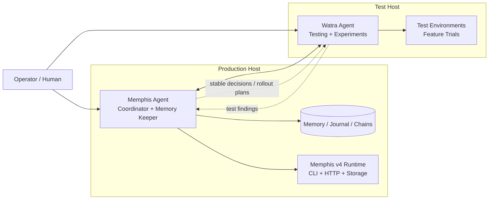

# Multi-Agent Architecture (Memphis ↔ Watra)

Operational split between production coordination (Memphis) and testing/experimentation (Watra).

```mermaid
flowchart LR
  HUMAN[Operator / Human]

  subgraph PROD[Production Host]
    MEM[Memphis Agent\nCoordinator + Memory Keeper]
    MEMSTORE[(Memory / Journal / Chains)]
    PRODSTACK[Memphis v4 Runtime\nCLI + HTTP + Storage]
  end

  subgraph TEST[Test Host]
    WAT[Watra Agent\nTesting + Experiments]
    TESTSTACK[Test Environments\nFeature Trials]
  end

  HUMAN --> MEM
  HUMAN --> WAT

  MEM <--> WAT
  MEM --> MEMSTORE
  MEM --> PRODSTACK
  WAT --> TESTSTACK

  WAT -. test findings .-> MEM
  MEM -. stable decisions / rollout plans .-> WAT
```
