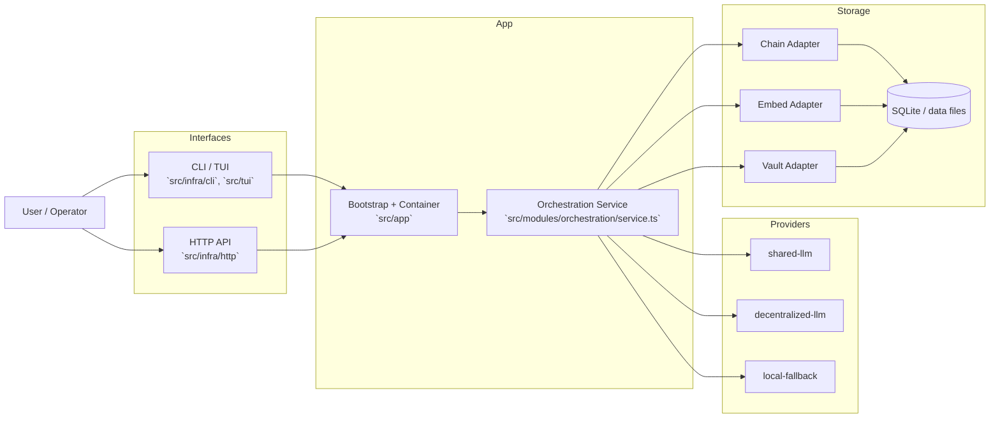

# System Overview

High-level architecture of Memphis v4 runtime components and their primary interactions.

```mermaid
flowchart LR
  U[User / Operator]

  subgraph Interfaces
    CLI[CLI / TUI\n`src/infra/cli`, `src/tui`]
    HTTP[HTTP API\n`src/infra/http`]
  end

  subgraph App
    BOOT[Bootstrap + Container\n`src/app`]
    ORCH[Orchestration Service\n`src/modules/orchestration/service.ts`]
  end

  subgraph Providers
    SHARED[shared-llm]
    DECENT[decentralized-llm]
    LOCAL[local-fallback]
  end

  subgraph Storage
    CHAIN[Chain Adapter]
    EMBED[Embed Adapter]
    VAULT[Vault Adapter]
    DB[(SQLite / data files)]
  end

  U --> CLI
  U --> HTTP
  CLI --> BOOT
  HTTP --> BOOT
  BOOT --> ORCH

  ORCH --> SHARED
  ORCH --> DECENT
  ORCH --> LOCAL

  ORCH --> CHAIN
  ORCH --> EMBED
  ORCH --> VAULT

  CHAIN --> DB
  EMBED --> DB
  VAULT --> DB
```
